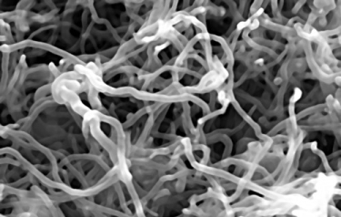

# CarbonNanotubes_ImageClassification
<b>Background:</b>
Carbon nanotubes forest are Carbon nanotubes which form vertically oriented cellular arrays during their growth.

<b>How are CNTs formed?</b>
- Catalyzed Chemical Vapor Deposition (catalyzed chemical vapor deposition of hydrocarbons over a metal catalyst )

- Under Different Process Parameteres
      
      - Catalyst Concentration
      
      - Growth Temperature
      
      - Feed flow Rate
      
      - Carrier Gas Flow etc
      
 - CNTs & some impurities are formed after the process.
 
 
  <b>Problem Statement:</b>
  Determine the best set of process parameters which result in the most effective production of carbon nanotubes
     

  <b>Methodologies Used: </b>
  
  Part A
                          Image Processing (using OpenCV Python)

                                          - Hough Circles

                                          - MinEnclosing

                                          - Contour Detection-

                                          - Gaussian Gradient

Part B
                           Machine Learning & Analytics

                                    - Support Vector Machine Regressors

         
   |ExpNum| ParticleVsFibreProportion(PartA) - SVM Output | Catalyst Concentration | Growth Temp | FeedFlow Rate | ... |
   | --- | --- | --- | --- | --- | --- |
  Experiment_1|
  Experiment_2|
  Experiment_3|
  Experiment_4|
